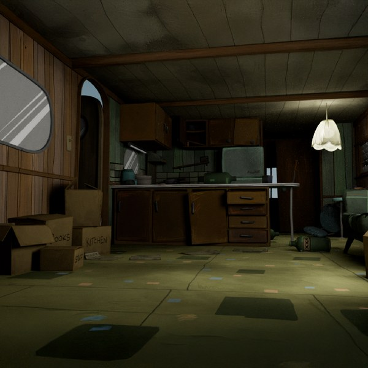
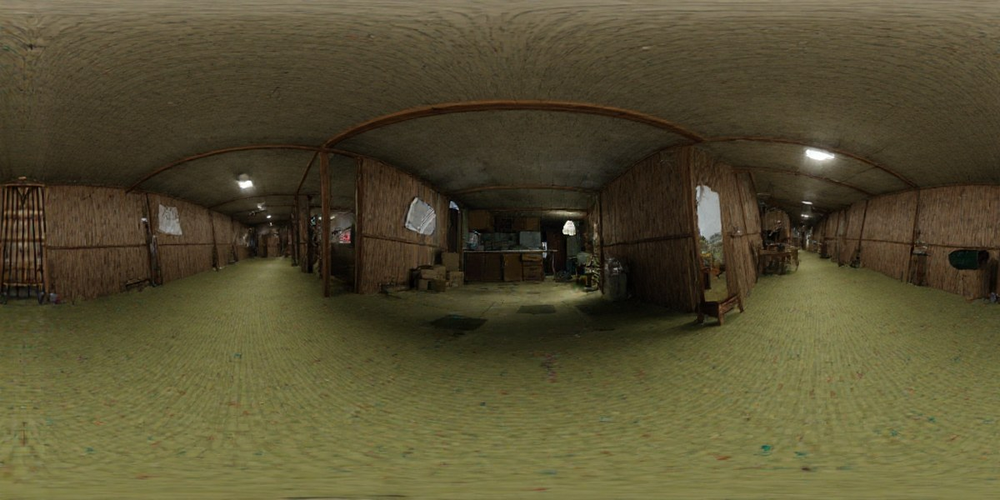
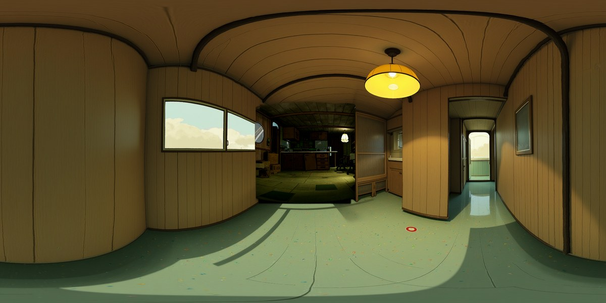
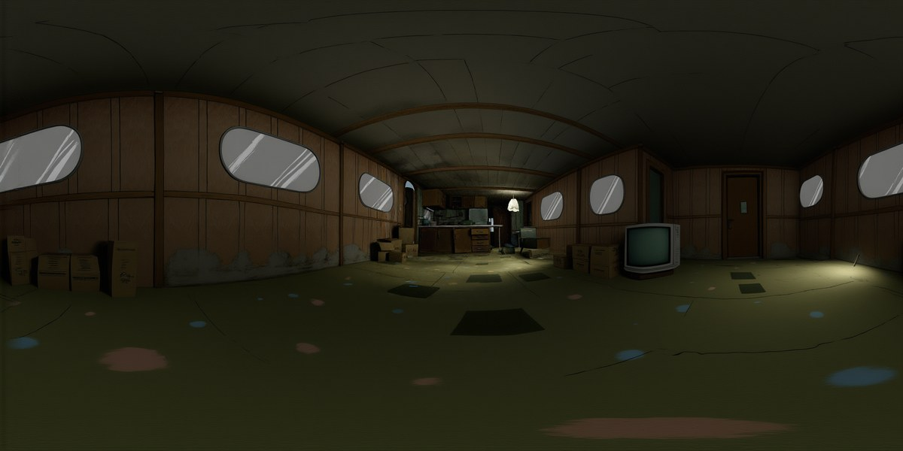

# pano_agent

Tools for generating 360° equirectangular panoramas from a single perspective image, plus a ComfyUI workflow builder for multi-view interior rendering.

---

## Modal panorama scripts

Three GPU scripts that run on [Modal](https://modal.com), each implementing a different outpainting approach. All three share the same first step: **DepthPro** estimates the camera's focal length so the perspective image is projected onto the equirectangular canvas with geometrically correct FOV before any model fills in the unseen regions.

### Source image



*Single perspective image of a vintage trailer interior — the input to all three pipelines.*

---

### WorldGen (`worldgen_pano.py`)

Uses **FLUX.1-dev Fill** + WorldGen's panoramic LoRA. Inpaints the unseen ~75% of the sphere after projecting the reference image onto a 1024×512 canvas.



```bash
modal run worldgen_pano.py --image input.jpg --prompt "vintage trailer interior"
```

| | |
|---|---|
| Base model | FLUX.1-dev Fill |
| LoRA | WorldGen panoramic (`worldgen_img2scene.safetensors`) |
| Output | 1024×512 |
| GPU | A100 40GB |

---

### DiT360 (`dit360_pano.py`)

Uses **FLUX.1-dev** + DiT360's panoramic LoRA with circular-padded attention and RFID inversion (Personalize Anything) to preserve projected pixels while outpainting. Higher fidelity at full panorama resolution.



```bash
modal run dit360_pano.py --image input.jpg --prompt "vintage trailer interior"
# Optional: --tau 30  (lower = tighter lock to source image, default 50)
```

| | |
|---|---|
| Base model | FLUX.1-dev |
| LoRA | DiT360 (`Insta360-Research/DiT360-Panorama-Image-Generation`) |
| Output | 2048×1024 |
| GPU | A100-80GB (~37 GB VRAM) |
| Paper | [arxiv 2510.11712](https://arxiv.org/abs/2510.11712) |

---

### HunyuanWorld (`hunyuan_pano.py`)

Uses **FLUX.1-Fill-dev** + HunyuanWorld's panoramic LoRA. Best results for preserving interior geometry — narrow spaces stay narrow. Supports higher resolutions and more inference steps for finer detail.



```bash
modal run hunyuan_pano.py --image input.jpg --prompt "vintage trailer interior" \
  --pano-h 1024 --pano-w 2048 --steps 75
```

| | |
|---|---|
| Base model | FLUX.1-Fill-dev |
| LoRA | HunyuanWorld-PanoDiT-Image (`tencent/HunyuanWorld-1`) |
| Output | 1024×2048 (configurable) |
| GPU | A100 40GB |
| Repo | [HunyuanWorld-1.0](https://github.com/Tencent-Hunyuan/HunyuanWorld-1.0) |

---

### Setup (one-time)

```bash
pip install modal
modal setup
modal secret create huggingface HF_TOKEN=hf_yourtoken
```

---

## ComfyUI workflow builder (pano_agent)

Generates multi-view flat-on cardinal renders of an interior space from a single reference image, emitting a ComfyUI workflow JSON.

```
pano_agent/
├── pano_agent/        ← shared library (brief, build, prompts)
├── cli/               ← Python CLI pipeline (one-shot, scriptable)
├── claude_code/       ← Claude Code pipeline (interactive, iterative)
└── tests/             ← test suite for the shared library
```

### Quick start — CLI

```bash
cd cli/
pip install anthropic
export ANTHROPIC_API_KEY=sk-...
python pano_agent_cli.py run ../reference.png -o ../workflow.json
```

### Quick start — Claude Code

```bash
cd claude_code/
claude --append-system-prompt "$(cat SESSION.md)" \
       "Analyze this reference image and write scene_brief.json. <attach reference.png>"
python build.py scene_brief.json -o workflow.json
```

The build pass generates 8 views (4 cardinals + 4 interstitial corners) with prompts that enforce flat-on camera, world-space lighting, canonical window specs, and no corner recesses. See `pano_agent/prompts.py`.

### Tests

```bash
python -m pytest tests/ -v
```
